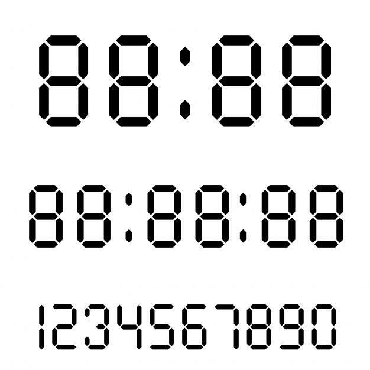

# Number to LCD Kata

## Requerimientos funcionales

### Parte 1
Escribe una programa que dado un número entero (con un número arbitrario de dígitos), lo convierta en números tipo LCD utilizando el siguiente formato:

   _  _     _  _  _  _  _  
 | _| _||_||_ |_   ||_||_|  
 ||_  _|  | _||_|  ||_| _|  
  
(cada digito tiene una altura de 3 líneas)

**NOTA:** Por favor, **NO** leer la segunda parte hasta completar la primera. Uno de los propósitos de esta kata es practicar la refactorización adaptando el código a cambios en los requerimientos.

### Parte 2

Modifica el programa para soportar un número variable de ancho y alto para cada dígito.
Por ejemplo, para ancho = 3 y alto = 2 el dígito 2 sería:

___
    |
    |
 ___
|
|
 ___

## Requerimientos no-funcionales
- Calidad
  - Utilizar estilo de código definido por la comunidad (apoyarse en Rubocop)
  - Pruebas unitarias
- Ejecución
  - Puede ejecutarse desde la linea de comandos y mostrar la salida en consola 
- Código fuente
  - Orientado a Objetos 
  - Métodos Pequeños
  - [Aplicar los principios SOLID](https://rubygarage.org/blog/solid-principles-of-ood)

## Tecnologías
- Lenguaje de programación Ruby
- Framework para pruebas [Rspec](https://rspec.info/) ó [Minitest](https://github.com/seattlerb/minitest)
- Línea de comando

## Entregable
- Código fuente en Github (1 por equipo)
- El repositorio debe reflejar el trabajo en equipo (en la conversación del repositorio, commits)
- Debe actualizar [este archivo](setup/README.md) en donde se describa el proceso para hacer funcionar el proyecto y el nombre de los integrantes del equipo
- Los commits de Git deben ser significativos
  
## Evaluación / Revisión
En la valoración se consideran los siguientes aspectos:
- Orientación a objetos
- Estructura de archivos
- Pruebas
- Código duplicado
- Separación de intereses (separation of concerns)
- Convenciones del lenguaje
- Claridad de la solución
- Abstracción
- Uso de características propias del lenguaje Ruby
- Uso de Git, commits bien definidos y atómicos

## Flujo de trabajo sugerido
1. Este ejercicio se realiza en formato de [Code Kata Grupal](https://github.com/bright-coders/commons/tree/master/topics/code-kata)
2. Dedica tiempo a leer y entender los requerimientos funcionales
3. Selecciona algún feature o requerimiento y escribe la(s) prueba(s) que debe pasar
4. Codifica la solución para ese feature (si lo consideras necesario puedes cambiar el orden es decir primero codificar y después escribir la prueba)
5. En tu primer intento no te preocupes demasiado por lo elegante de tu solución sino por pasen todas las pruebas
6. Una vez que la solución funciona, haz un ejercicio de refactorización asegurandote que las pruebas sigan pasando
7. Toma el siguiente feature o requerimiento y repite el proceso

## Setup
En [este elnace](setup/README.md) se describen los pasos necesarios para ejecutar/probar este proyecto, así como los integrantes de este equipo

## Enlaces
### Commits
- [You Need to Write Meaningful Commit Messages](https://medium.com/better-programming/you-need-meaningful-commit-messages-d869e44e98d4) 
- [Writing meaningful git commit messages](https://medium.com/@menuka/writing-meaningful-git-commit-messages-a62756b65c81)
- [How to Write a Git Commit Message](https://chris.beams.io/posts/git-commit/)
### Tools
- [Rubocop](https://rubocop.org/)
- [Rubycritic](https://github.com/whitesmith/rubycritic) 
- [Rspec](https://rspec.info/)
- [Minitest](https://github.com/seattlerb/minitest)
### Solid Principles
- [SOLID Object-Oriented Design Principles with Ruby Examples](https://rubygarage.org/blog/solid-principles-of-ood)
- [Back to Basics: SOLID](https://thoughtbot.com/blog/back-to-basics-solid)
- [SOLID Principles](https://www.netguru.com/codestories/solid-principles-1-single-responsibility-principle) 

